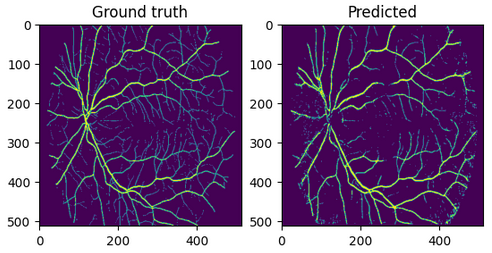

# Machine Learning

## Preprocessing

Each image is divided into sections of resolution NxN. To obtain them, following operations are performed:
- [CLAHE](https://en.wikipedia.org/wiki/Adaptive_histogram_equalization): Contrast Limited Adaptive Histogram Equalization for enhancing the contrast of an image.
- Padding: A border of size $\lfloor \frac{N-1}{2} \rfloor$ filled with 0s is created and added around the image.
- Extract sections: The transformed image is iterated pixel by pixel, and sections are extracted.

## Feature extraction

The next step involves converting each image section into a feature vector consisting of following values:
- Mean values of each channel (R, G, B)
- Standard deviation of each channel (R, G, B)
- Hu moments (7)

Giving a total of 13 features.

## XGBoost

After conducting performance test which part of is available in [compare.ipynb](compare.ipynb) notebook, XGBoost classifier was selected as the best model.

XGBoost is a highly regarded ensemble method that leverages gradient boosting algorithms to update model parameters. Through iterative cycles, it trains a sequence of models by making predictions with a naive model, calculating the loss function, training a new model based on the computed loss, and adding it to the ensemble. The number of cycles can be controlled using the <em>n_estimators</em> parameter of the <em>XGBClassifier()</em>, which is utilized in this project. This approach allows XGBoost to continually improve model performance.

## Results

The classifier was trained on 15 images of resolution 512x512 and 5x5 sections.

  

The classification report below shows the results for 5 unseen images of resolution 512x512:

|    Class    | Precision |  Recall  | F1-Score | Support |
|:-----------:|:---------:|:--------:|:--------:|:-------:|
|      0      |    0.98   |   0.97   |   0.98   |  1220569 |
|      1      |    0.67   |   0.70   |   0.68   |   90151  |
|             |           |          |          |         |
|  Accuracy   |           |          |   0.96   | 1310720 |
|  Macro Avg  |    0.82   |   0.84   |   0.83   | 1310720 |
|Weighted Avg |    0.96   |   0.96   |   0.96   | 1310720 |

The occurrence of blood vessels is denoted as a positive label.
